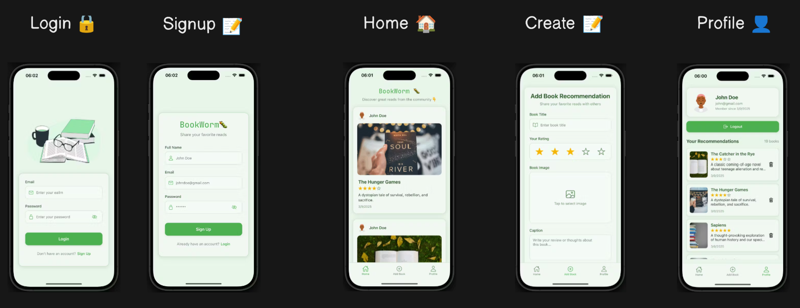

# BookWorm - Backend

## 📌 Overview
This is the **backend** of the Book Recommendation App, built using **Node.js** and **Express.js**. It provides a secure RESTful API for user authentication and book recommendation management.

## 🔗 Related Links
- **Frontend Repository:** [BookWorm](https://github.com/sudo-dpkg/bookworm)
- **App Download Link:** [Apk Download](https://github.com/sudo-dpkg/bookworm/releases/tag/v1)

## 🚀 Features
- User Authentication with **JWT (JSON Web Tokens)**
- Secure API Endpoints with **Express Middleware**
- **CRUD Operations** for Book Recommendations
- **MongoDB** for Storing User and Post Data
- **Pagination and Infinite Scrolling** Support
- **CORS Handling** for Secure Frontend Communication
- **Multer Integration** for Image Uploads
- **Cron Jobs** for Scheduled Task Automation

## 🛠 Tech Stack
- **Node.js** - Backend Runtime Environment
- **Express.js** - Web Framework
- **MongoDB** - Database for Storing Users & Posts
- **Mongoose** - ODM for MongoDB
- **JWT** - Authentication & Security
- **Multer** - Middleware for Handling File Uploads
- **Cron** - Scheduled Task Automation
- **Dotenv** - Environment Variable Management

## 📡 API Endpoints
| Method | Endpoint | Description |
|--------|----------|-------------|
| POST | `/api/auth/register` | User Registration |
| POST | `/api/auth/login` | User Login |
| GET | `/api/books` | Fetch All Posts |
| POST | `/api/books` | Create a New Post |
| DELETE | `/api/books/:id` | Delete a Post |
| GET | `/api/books/user` | Fetch User Posts |

## APP Preview
